# Controller FSM Knowledge Graph

This graph maps the finite-state-machine behavior spread across the Kubernetes controllers in `internal/controller` and the node-local daemon controllers in `pkg/daemon`.

## Legend

- `Controller` nodes own reconcile logic.
- `Status` nodes are CR status fields that carry FSM state.
- `Phase` nodes are states in those fields.
- `Object` nodes are Kubernetes or Cloud Hypervisor resources that drive transitions.
- Edge labels describe the condition or action that moves the FSM.

## High-level Knowledge Graph

```mermaid
flowchart LR
  subgraph VM["VirtualMachine.status.phase"]
    VMEmpty["\"\""]
    VMPending["Pending"]
    VMScheduling["Scheduling"]
    VMScheduled["Scheduled"]
    VMRunning["Running"]
    VMSucceeded["Succeeded"]
    VMFailed["Failed"]
    VMUnknown["Unknown"]
    VMPodResize["PodResizeInProgress"]
    VMResize["ResizeInProgress"]
    VMSnapshotting["SnapshotInprogress"]
    VMRestore["VMRestoreInProgress"]
    VMPaused["Paused"]
    VMResumed["Resumed"]
  end

  subgraph MIG["VirtualMachine.status.migration.phase / VirtualMachineMigration.status.phase"]
    MigPending["Pending"]
    MigScheduling["Scheduling"]
    MigScheduled["Scheduled"]
    MigTargetReady["TargetReady"]
    MigRunning["Running"]
    MigSent["Sent"]
    MigSucceeded["Succeeded"]
    MigFailed["Failed"]
  end

  subgraph SNAP["VMSnapShot.status.phase"]
    SnapEmpty["\"\""]
    SnapScheduled["Scheduled"]
    SnapInProgress["InProgress"]
    SnapCreated["Created"]
    RestoreSpecCreated["VMRestoreSpecCreated"]
    SnapReady["ReadyToUse"]
    SnapFailed["Failed"]
  end

  subgraph VDS["VirtualDiskSnapshot.status.phase"]
    VDSPending["Pending"]
    VDSInProgress["InProgress"]
    VDSReady["ReadyToUse"]
    VDSError["Error"]
    VDSDeleting["Deleting"]
  end

  subgraph VD["VirtualDisk.status.phase"]
    VDPending["Pending"]
    VDBound["Bound"]
    VDReady["Ready"]
    VDFailed["Failed"]
    VDTerminating["Terminating"]
  end

  subgraph RB["VMRollback.status.phase"]
    RBEmpty["\"\""]
    RBScheduled["Scheduled"]
    RBSucceeded["Succeeded"]
    RBFailed["Failed"]
  end

  VMController["VirtualMachineReconciler"]
  DaemonVMController["pkg/daemon VMReconciler"]
  VMMController["VMMReconciler"]
  SnapAPIController["internal VMSnapShotReconciler"]
  SnapDaemonController["pkg/daemon VMSnapShotReconciler"]
  VDSController["VirtualDiskSnapshotReconciler"]
  VDController["VirtualDiskReconciler"]
  RBController["VMRollbackReconciler"]
  SetPoolControllers["VMSetReconciler / VMPoolReconciler"]

  Pod["VM Pod"]
  TargetPod["target VM Pod"]
  HotplugPod["hotplug volume Pod"]
  CH["Cloud Hypervisor VM"]
  VolumeSnapshot["CSI VolumeSnapshot"]
  DataVolume["CDI DataVolume"]
  RestoreSpec["VMRestoreSpec"]
  NewVM["restored VirtualMachine"]

  SetPoolControllers -- "create/delete child VMs; count Running" --> VMController

  VMEmpty -- "runPolicy or PowerOn" --> VMPending
  VMSucceeded -- "RunAlways/RerunOnFailure/PowerOn" --> VMPending
  VMFailed -- "RunAlways/RerunOnFailure/PowerOn" --> VMPending
  VMPending -- "allocate vmPodName" --> VMScheduling
  VMScheduling -- "create owner VM Pod" --> Pod
  Pod -- "PodRunning + hotplug volumes attached" --> VMScheduled
  Pod -- "PodSucceeded" --> VMSucceeded
  Pod -- "PodFailed" --> VMFailed
  Pod -- "PodUnknown" --> VMUnknown

  VMScheduled -- "daemon mounts hotplug volumes" --> DaemonVMController
  DaemonVMController -- "VmCreate + VmBoot" --> CH
  CH -- "state Running" --> VMRunning
  CH -- "state Paused" --> VMPaused
  CH -- "state Shutdown" --> VMFailed

  VMRunning -- "pod resize needed" --> VMPodResize
  VMPodResize -- "pod resize complete" --> VMResize
  VMResize -- "Cloud Hypervisor resize complete" --> VMRunning
  VMRunning -- "pause RPC" --> VMPaused
  VMPaused -- "resume RPC requested" --> VMResumed
  VMResumed -- "VmResume succeeds" --> VMRunning
  VMRunning -- "RunPolicy Halted or shutdown/power action completes" --> VMSucceeded

  VMMController -- "VM must be Running and Migratable=True" --> MigPending
  MigPending -- "stamp VirtualMachine.status.migration" --> VMRunning
  VMRunning -- "VM controller names target pod" --> MigScheduling
  MigScheduling -- "create target VM Pod" --> TargetPod
  TargetPod -- "PodRunning + target hotplug volumes attached" --> MigScheduled
  TargetPod -- "PodFailed/Succeeded/Unknown" --> MigFailed
  MigScheduled -- "target daemon starts receive socket + relay" --> MigTargetReady
  MigTargetReady -- "source daemon starts send relay + VmSendMigration" --> MigRunning
  MigRunning -- "source pod succeeds + cleanup" --> MigSent
  MigRunning -- "send error or missing channel" --> MigFailed
  MigSent -- "target CH state Running; swap VM node/pod status" --> MigSucceeded
  MigSucceeded -- "VMM mirrors phase and clears VM migration stamp" --> VMRunning
  MigFailed -- "VMM mirrors phase and clears VM migration stamp" --> VMRunning

  SnapEmpty -- "source VM found" --> SnapScheduled
  SnapEmpty -- "source VM missing" --> SnapFailed
  SnapScheduled -- "daemon sees VM Running; mark VM snapshotting" --> VMSnapshotting
  VMSnapshotting -- "daemon blocks VM lifecycle changes" --> SnapInProgress
  SnapInProgress -- "memory snapshot + disk snapshot resources created" --> SnapCreated
  SnapInProgress -- "snapshot error" --> SnapFailed
  SnapCreated -- "create VMRestoreSpec" --> RestoreSpec
  RestoreSpec -- "status phase" --> RestoreSpecCreated
  RestoreSpecCreated -- "all owned VirtualDiskSnapshots ReadyToUse" --> SnapReady
  RestoreSpecCreated -- "any owned VirtualDiskSnapshot Error or missing" --> SnapFailed
  SnapInProgress -- "defer: restore VM phase" --> VMRunning

  VDSController -- "create CSI VolumeSnapshot" --> VolumeSnapshot
  VolumeSnapshot -- "no creationTime yet" --> VDSPending
  VolumeSnapshot -- "creationTime set" --> VDSInProgress
  VolumeSnapshot -- "readyToUse=true" --> VDSReady
  VolumeSnapshot -- "status.error set" --> VDSError
  VDSReady -- "feeds VMSnapShot diskStatus ready" --> RestoreSpecCreated
  VDSError -- "fails parent VMSnapShot" --> SnapFailed

  VDController -- "create CDI DataVolume" --> DataVolume
  DataVolume -- "phase Succeeded" --> VDReady
  VDReady -- "used as VM PVC volume or snapshot PVC source" --> VMController

  RBEmpty -- "initialize rollback" --> RBScheduled
  RBScheduled -- "read VMSnapShot + VMRestoreSpec" --> RBController
  RBController -- "recover disk snapshots to PVCs" --> VDReady
  RBController -- "create new VM with restored PVCs + memory volume" --> NewVM
  NewVM -- "normal VM lifecycle" --> VMEmpty
  RBController -- "create succeeded" --> RBSucceeded
  RBController -- "missing snapshot/restore spec/recovery error" --> RBFailed
```

## Controller-owned FSM Edges

| Owner | Status field | Transition | Trigger/action |
| --- | --- | --- | --- |
| `VirtualMachineReconciler` | `VirtualMachine.status.phase` | `""`, `Succeeded`, `Failed` -> `Pending` | Run policy or `PowerOn` says the VM should run after old pods are deleted. |
| `VirtualMachineReconciler` | `VirtualMachine.status.phase` | `Pending` -> `Scheduling` | Generates `status.vmPodName`. |
| `VirtualMachineReconciler` | `VirtualMachine.status.phase` | `Scheduling` -> `Scheduled` | Owned VM Pod is `Running` and hotplug volumes are attached to the node. |
| `VirtualMachineReconciler` | `VirtualMachine.status.phase` | `Scheduling`/`Scheduled`/`Running` -> `Succeeded`/`Failed`/`Unknown` | Mirrors terminal or unknown VM Pod phase. |
| `pkg/daemon VMReconciler` | `VirtualMachine.status.phase` | `Scheduled` -> `Running` | Creates/boots Cloud Hypervisor VM, then observes CH state `Running`. |
| `pkg/daemon VMReconciler` | `VirtualMachine.status.phase` | `Scheduled` -> `VMRestoreInProgress` -> `Resumed` -> `Running` | Memory snapshot volume present; daemon restores CH from staged memory snapshot and resumes. |
| `VirtualMachineReconciler` + daemon | `VirtualMachine.status.phase` | `Running` -> `PodResizeInProgress` -> `ResizeInProgress` -> `Running` | Pod resource resize completes, then CH CPU/memory resize completes. |
| `VMMReconciler` | `VirtualMachineMigration.status.phase` | any non-terminal -> `Pending`/`Failed` | Validates source VM, migratable condition, and one migration per VM. |
| `VMMReconciler` | `VirtualMachine.status.migration` | nil -> `Pending` | Stamps migration UID and phase onto the VM; VM controllers drive the rest. |
| `VirtualMachineReconciler` | `VirtualMachine.status.migration.phase` | `Pending` -> `Scheduling` -> `Scheduled` | Creates target VM Pod and target hotplug volume pod if needed. |
| `pkg/daemon VMReconciler` | `VirtualMachine.status.migration.phase` | `Scheduled` -> `TargetReady` -> `Running` -> `Sent` -> `Succeeded` | Target daemon starts receive relay; source daemon sends; target daemon verifies CH `Running` and swaps VM node/pod status. |
| `VMMReconciler` | `VirtualMachineMigration.status.phase` | in-flight -> `Succeeded`/`Failed` | Mirrors `VirtualMachine.status.migration.phase`; clears the VM migration stamp when terminal. |
| `internal VMSnapShotReconciler` | `VMSnapShot.status.phase` | `""` -> `Scheduled`/`Failed` | Source VM lookup succeeds or fails. |
| `pkg/daemon VMSnapShotReconciler` | `VMSnapShot.status.phase` | `Scheduled` -> `InProgress` -> `Created` -> `VMRestoreSpecCreated` -> `ReadyToUse` | Marks VM snapshotting, creates memory/disk snapshots, creates restore spec, waits for disk snapshots. |
| `pkg/daemon VMSnapShotReconciler` | `VirtualMachine.status.phase` | `Running` -> `SnapshotInprogress` -> `Running` | Locks VM lifecycle during memory snapshot; deferred status update restores `Running`. |
| `VirtualDiskSnapshotReconciler` | `VirtualDiskSnapshot.status.phase` | `Pending`/`InProgress`/`ReadyToUse`/`Error` | Maps CSI `VolumeSnapshot.status` fields to VirtualDiskSnapshot phase. |
| `VirtualDiskReconciler` | `VirtualDisk.status.phase` | any non-ready -> `Ready` | CDI `DataVolume.status.phase == Succeeded`. |
| `VMRollbackReconciler` | `VMRollback.status.phase` | `""` -> `Scheduled`; `Scheduled` -> `Succeeded`/`Failed` | Reads snapshot and restore spec, recovers disk PVCs, creates a new VM with restored volumes. |
| `VMSetReconciler` / `VMPoolReconciler` | aggregate status | desired replicas -> current child VMs | Create/delete child VMs and report counts; they depend on child VM `Running` status rather than owning a phase FSM. |

## Cross-controller Handoffs

| Producer | Shared state/object | Consumer | Meaning |
| --- | --- | --- | --- |
| `VMMReconciler` | `VirtualMachine.status.migration` | `VirtualMachineReconciler` | Starts the migration pipeline. |
| `VirtualMachineReconciler` | target VM Pod and migration target fields | `pkg/daemon VMReconciler` on target node | Gives daemon enough data to prepare receive migration. |
| `pkg/daemon VMReconciler` target node | `TargetNodeIP`, `TargetNodePort`, `TargetReady` | `pkg/daemon VMReconciler` source node | Lets source relay CH migration stream to target. |
| `pkg/daemon VMReconciler` target node | `Succeeded` and VM node/pod status swap | `VMMReconciler` | Completes public `VirtualMachineMigration` and clears VM stamp. |
| `internal VMSnapShotReconciler` | `Scheduled` VMSnapShot phase | `pkg/daemon VMSnapShotReconciler` on VM node | Starts node-local memory snapshot and disk snapshot creation. |
| `pkg/daemon VMSnapShotReconciler` | owned `VirtualDiskSnapshot` resources | `VirtualDiskSnapshotReconciler` | Delegates disk snapshot execution to CSI snapshots. |
| `VirtualDiskSnapshotReconciler` | `VirtualDiskSnapshot.status.phase` | `pkg/daemon VMSnapShotReconciler` | Parent snapshot waits until every disk snapshot is `ReadyToUse`. |
| `pkg/daemon VMSnapShotReconciler` | `VMRestoreSpec` plus memory/disk snapshot status | `VMRollbackReconciler` | Rollback reconstructs PVCs and creates a replacement VM. |
| `VirtualDiskReconciler` | ready PVC/DataVolume-backed disk | `VirtualMachineReconciler`, `VirtualDiskSnapshotReconciler` | VM uses PVCs as volumes; disk snapshot snapshots the PVC. |

## Source Anchors

- VM API-side lifecycle and target pod migration scheduling: `internal/controller/virtualmachine_controller.go` lines 190-468.
- VM node-side Cloud Hypervisor lifecycle, restore, resize, power, and migration send/receive: `pkg/daemon/vm_controller.go` lines 128-588.
- Public `VirtualMachineMigration` validation, stamping, mirroring, and cleanup: `internal/controller/migration_controller.go` lines 70-190.
- Snapshot node-side FSM and disk snapshot aggregation: `pkg/daemon/snapshot_controller.go` lines 79-216.
- Disk snapshot to CSI `VolumeSnapshot` mapping: `internal/controller/virtualdisksnapshot_controller.go` lines 88-238.
- Disk provisioning to CDI `DataVolume`: `internal/controller/virtualdisk_controller.go` lines 88-158.
- Rollback restore flow: `internal/controller/vmrollback_controller.go` lines 70-215.
- CRD phase enums: `config/crd/bases/cloudhypervisor.quill.today_virtualmachines.yaml`, `cloudhypervisor.quill.today_virtualmachinemigrations.yaml`, `cloudhypervisor.quill.today_vmsnapshots.yaml`, `cloudhypervisor.quill.today_virtualdisksnapshots.yaml`, and `cloudhypervisor.quill.today_virtualdisks.yaml`.

## Implementation Notes

- `VirtualMachineMigration.status.phase` is a public mirror of `VirtualMachine.status.migration.phase`; the VM-embedded status is the actual work queue for the VM and daemon controllers.
- The VM snapshot FSM is split intentionally: the API-side controller only schedules and protects the object, while the daemon-side controller performs node-local memory snapshot work and waits on disk snapshot resources.
- `VirtualDisk.status.phase` has CRD enum values for `Pending`, `Bound`, `Ready`, `Failed`, and `Terminating`, but the current reconciler only drives the observed success path to `Ready`.
- `VMRollback.status.phase` is not constrained by a CRD enum in this checkout, but the reconciler uses `Scheduled`, `Succeeded`, and `Failed`.
- Observation: in `VirtualMachineReconciler` migration scheduling, the `targetVMPodNotFound` local is declared but the `IsNotFound` branch writes `vmPodNotFound`; that can affect target pod creation behavior.
